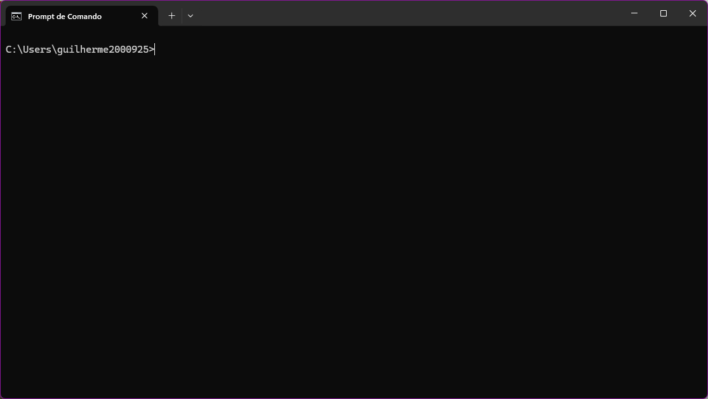
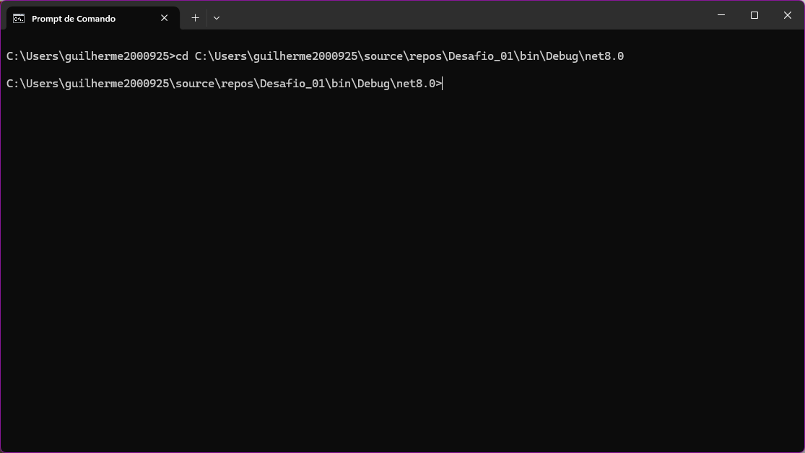
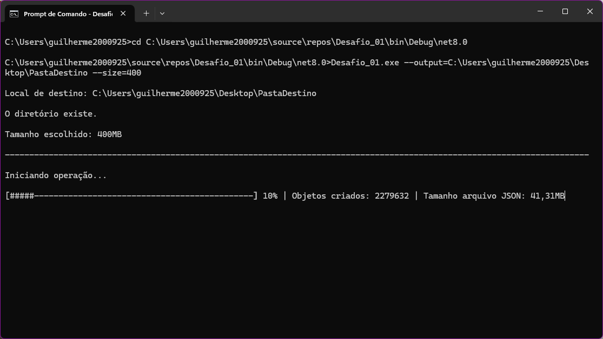
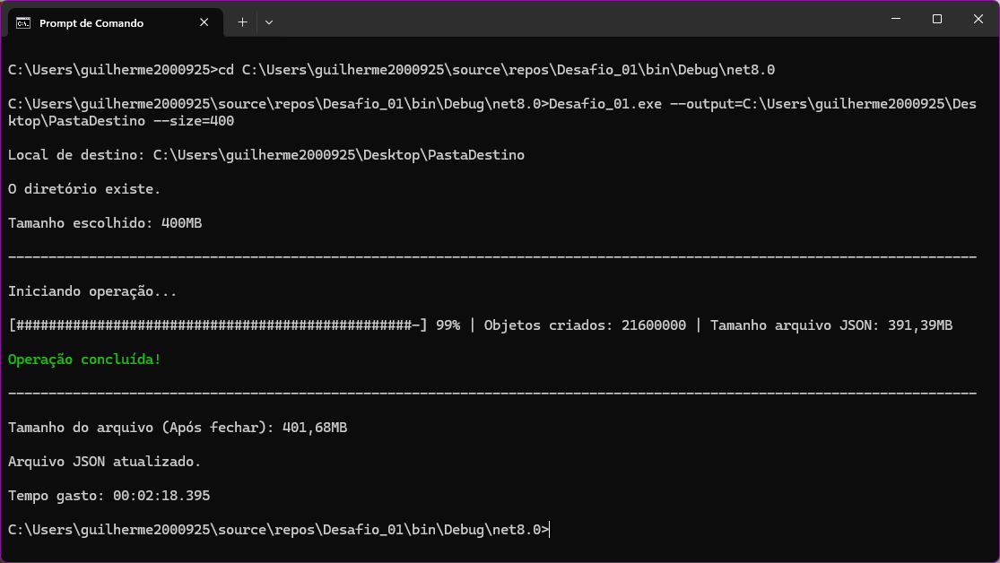

<h1 align="center">
   Gerador de Arquivo JSON
</h1>

    
    

<h2>
    Descrição do Projeto
</h2>

<ol>
    <li>
        <strong>Objetivo</strong>
        

            Desenvolvido usando Console Application em C# que gera um arquivo no formato JSON
            contendo uma coleção de objetos com exatamente 4 propriedades (A, B, C e D). 
            Cada propriedade é preenchida com uma string alfanumérica aleatória. 
        

    </li>
    <li>
        <strong>Especificações</strong>
        <ul>
            2.1. <strong>Aplicação Console</strong>
            <ul>
                É necessário passar dois parâmetros: Caminho de saída (--output) e
                Tamanho alvo do arquivo, em megabytes (--size).
            </ul>
            2.2. <strong>Formato do JSON</strong>
            <ul>
                O arquivo final é estruturado como uma raiz de objetos 
                (ex: {"A": "......", "B": "......", "C": "......","D": "......"}).
            </ul>
            2.3. <strong>Dados Aleatórios</strong>
            <ul>
                Cada campo (A, B, C, D) contém ums string alfanumérica de 6 caracteres.
            </ul>
            2.4. <strong>Tamanho do Arquivo</strong>
            <ul>
                <li>
                    Gera um arquivo com o tamanho escolhido com ±1% de tolerância. 
                    O tamanho limite foi estabelecido em 400MB.
                </li>
                <li>
                    A quantidade de registros é calculada dinamicamente a cada escrita no arquivo.
                </li>
            </ul>
            2.5. <strong>Performance & Escalabilidade</strong>
            <ul>
                <li>
                    Não carrega toda a coleção em memória antes de gravar.
                </li>
                <li>
                    É utilizado técnicas de streaming de saída para minimizar consumo de RAM (ex: System.Text.Json).
                </li>
                <li>
                    No código mostra como foi calculado o número de registros e o valor para o loop de gravação.
                </li>
            </ul>
        </ul>
    </li>
</ol>

<h2>
  Funcionalidades do Projeto
</h2>

<ul>
    <li>
        <strong>Linha de Comando</strong>: Via linha de comando é necessário passar dois argumentos para iniciar 
        (ex: --output=C:\\Users\\guilherme2000925\\Desktop\\PastaDestino --size=400), é utilizado dois métodos 
        para tratativa dos argumentos onde é retirado o caminho de saída e o tamanho do arquivo, após isso é usado
        dois métodos que checa se o caminho existe e imprime a mensagem e o outro método imprime o tamanho convertido 
        em MB ou GB se necessário.
    </li>
    <li>
        <strong>Tempo Gasto</strong>: É utilizado um método que conômetra o tempo que leva para gerar o arquivo JSON
        e imprime no terminal o tempo após finalizar a tarefa.
    </li>
    <li>
        <strong>Gerador Arquivo JSON</strong>: Nesse arquivo é utilizado vários métodos, temos um que gera a linha
        que irá ser serializada, um que imprime a barra de progresso da tarefa, um que calcula o tamanho do arquivo
        enquanto ele é gerado, outro que mostra o tamanho final do arquivo após ele ser finalizado e o método de escrita
        onde ele escreve através de um for e interrompe a geração e fecha o arquivo caso ele passe do limite de tolerância.
    </li>
    <li>
        <strong>Gerador String Alfanumérica</strong>: É utilizado dois métodos, um privado que gera a string 
        e outro público que chama o método privado, o método privado tem uma string alfanumérica e com ela gera de forma  
        aleatória uma nova string usando for e adiona o carácter em uma nova variável.
    </li>
</ul>

<h2>
  Rodando o código
</h2>

    
    
    
    

<h2>
  Técnicas e Tecnologias Utilizadas
</h2>

<ul>
    <li>
        <strong>System.Diagnostics</strong>
    </li>
    <li>
        <strong>System.Text.Json</strong>
    </li>
    <li>
        <strong>System.Text</strong>
    </li>
    <li>
        <strong>.NET 8</strong>
    </li>
    <li>
        <strong>Visual Studio</strong>
    </li>
</ul>